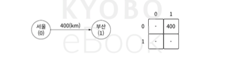
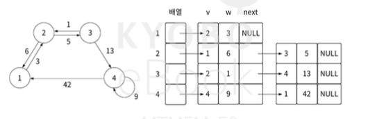

# 그래프의 개념

그래프는 노드(vertex)와 간선(edge)을 이용한 비선형 데이터 구조다.
간선은 방향이 있을 수도 없을 수도 있다.
관계나 흐름에서 정도를 표현할 필요가 있다면 가중치라는 개념으로 표현 가능.

## 그래프의 특징과 종류
- 방향이 있는 간선을 포함하면 방향 그래프(directed graph)
- 방향이 없는 간선을 포함하면 무방향 그래프(undirected graph)
- 데이터 흐름의 양, 정도를 간선에 표현하여 가중치가 있는 그래프를 가중치 그래프(weighted graph)
- 순환 그래프(cycle graph)
- 비순환 그래프(acyclic graph)

## 인접 행렬 그래프 표현
그래프의 구현 방식에는 인접 행렬, 인접 리스트가 있다.

### 인접 행렬
2차원 배열로 표현한다.
인덱스가 노드, 배열의 값은 노드의 가중치, 인덱스의 세로방향을 출발노드,
인덱스의 가로 방향을 노착 노드로 표현 한다.

### 인접 리스트
값(v), 가중치(w), 다음 노드(next)를 묶어서 관리한다.

1. 노드 개수만큼 배열을 준비한다.
2. 배열의 인덱스는 각 시작 노드를 의미하며 배열의 값에는 다음 노드를 연결한다.

보통은 인접 행렬이 O(1)로 유리해서
인접 행렬로 푸는 경우가 많다.
노드 개수가 1000개 미만으로 주어지는 경우
인접 행렬을 쓰면 된다.
>노드의 데이터가 숫자가 아니라 문자열이면
문자열을 숫자로 매핑하여 인접 행렬의 인덱스로 사용하면 된다.

---

# 그래프 탐색
깊이 우선 탐색(dfs), 너비 우선 탐색(bfs)이 있다.

## 깊이 우선 탐색
시작 노드를 정하고, 스택에 시작노드를 푸시한다.
스택에 있는 노드는 아직 방문하지 않았지만 방문 예정인 노드들이다.
다음 과정을 반복한다.

1. 스택이 비었는지 체크, 비었다면 탐색 종료
2. 스택에서 노드를 팝한다. 팝한 원소는 최근에 스택에 푸시한 노드다.
3. 팝한 노드의 방문 여부를 체크, 방문 했다면 처리 필요 x, 방문 안했다면 방문 처리
4. 방문한 노드와 인접한 노드를 체크, 방문 안한건 스택에 푸시한다. 방문 순서를 고려해야 한다면 푸시할때 그에 맞게 한다.

### 고려사항
1. 탐색할 노드가 없을 때까지 간선을 타고 내려갈 수 있어야 한다.
2. 가장 최근에 방문한 노드를 알아야 한다.
3. 이미 방문한 노드인지 확인 가능 해야 한다.

dfs의 핵심은 
**가장 깊은 노드까지 방문 후,
더 이상 방문할 노드가 없으면
최근 방문한 노드로 돌아온 뒤,
해당 노드에서 방문할 노드가 있는지 확인한다**는 것.

스택을 활용해서 탐색방향의 역방향으로 되돌아가는 동작을
'백트래킹' 이라고 한다.

dfs 구현 방법은 스택 활용, 재귀 활용 방법이 있다.

bfs구현 방법은 큐를 활용한다.

**최단 경로 찾는 문제가 아니면 dfs를 고려하는게 좋다.**

---

# 그래프 최단 경로 구하기
가중치가 없는 그래프면 간선 개수가 가장 적은게 최단 경로다.
가중치가 있으면 가중치의 총합이 최소가 되는게 최단 경로다.

최단 경로 구하는 다익스트라 알고리즘, 벨만-포드 알고리즘을 알아보자.

## 다익스트라 알고리즘
1959년 에츠허르 데이크스트라(네덜란드 사람)가 발표한 최단경로 알고리즘이다.
가중치가 있는 그래프 최단 경로 구하는건 대부분 다익스트라 쓴다고 보면 된다.

음의 가중치가 있으면 다익스트라가 최단 경로 보장 안된다.
항상 양의 가중치만 있다고 보장되는 문제라면 최단 경로 보장 된다.

다익스트라는 그리디 개념으로, 항상 최소 가중치를 선택 해나가는 방법이다.

## 벨만-포드 알고리즘
다익스트라와 다르게,
매 단계마다 모든 간선의 가중치를 다시 확인하여 최소 비용을 갠신한다.
음의 가중치를 가지는 그래프에서도 최단 경로를 구할 수 있다.

그러나 음의 순환이 있는 그래프의 경우, 무한 루프에 빠진다.

